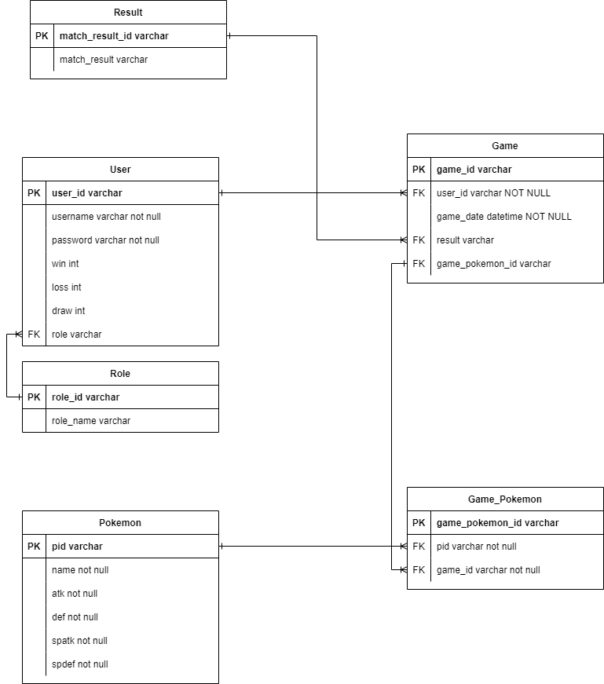

# P1 - Java/Angular Solo Project - Backend

## Introduction

This is a Java and Angular based application that will utilize the Poke API to extract certain information to use in the application. It will allow users to play against a CPU using information from the Poke API. Any data that result from a match will then be stored into a database. This data also includes a login feature for separate accounts to view their match history and compare their win/loss ratio to other unique users that exist in the database. On the backend only, there will exist methods to get Pokemon and various stats from the PokeAPI and calls to a database to get user related information.

## User Stories

- **As a user**, I want to register an account 
- **As a user**, I want to log in to my account 
- **As a user**, I want to get various Pokemon using the Poke API
- **As a user**, I want to view my win loss ratio
- **As a user**, I want to view a leaderboard of all the users given a match history
- **As a user**, I should win/lose a match and should get that reflected on my user stats

## MVP (Minimum Viable Product)

- User registration and login
- Giving user random Pokemon name and stats
- Have a Pokemon Model that translates API data to usable data
- Leaderboard that can see various information from users

## Stretch Goals

- Implementing Pokemon typing and its downsides and upsides against other Pokemon
- Allowing user to change password
- Adding an admin role that can add, remove, or modify Pokemon API interpretations
- Add multiplayer with another player

## Tech Stacks

- **Java**: One of the main programming languages used for building the application.
- **Spring**: A framework used for the ease of integrating REST APIs
- **Typescript**: The front end logic of the application.
- **PostgreSQL**: Used as the database to store user, product, and order data.
- **Maven or Gradle**: Used for managing project dependencies.
- **JUnit**: A testing framework for Java applications, used to ensure our code works as expected.
- **Log4j**: A logging utility for debugging purposes.
- **JDBC (Java Database Connectivity)**: An API for connecting and executing queries on the database.
- **BCrypt**: A Java library for hashing and checking passwords for security.
- **JUnit, Mockito, and PowerMock**: Used for unit and integration testing.
- **Git and GitHub**: Used for version control.

## Requirements

- **Clean Codebase**: All code should be clean and well-documented. The repository should not include any unnecessary files or folders such as the `target/`, `.DS_Store`, etc. All files and directories should be appropriately named and organized.

- **Database Design**: The database should be designed following the principles of the 3rd Normal Form (3NF) to ensure data integrity and efficiency. An Entity Relationship Diagram (ERD) should be included in the documentation.

- **Secure**: All sensitive user data such as passwords must be securely hashed before storing it in the database. The application should not display any sensitive information in error messages.

- **Error Handling**: The application should handle potential errors gracefully and provide clear and helpful error messages to the users.

- **Testing**: The application should have a high test coverage. Unit tests and integration tests should be implemented using JUnit, Mockito, and PowerMock.

- **Version Control**: The application should be developed using a version control system, preferably Git, with regular commits denoting progress.

- **Documentation**: The repository should include a README file with clear instructions on how to run the application. Code should be well-commented to allow for easy understanding and maintenance.

- **Scalable**: The design of the application should be scalable, allowing for easy addition of new features or modifications in the future.

